# Prueba Plataforma Básica de Selección de Practicantes 

Este proyecto es una aplicación web de gestión y selección de practicantes. Permite registrar, visualizar y clasificar candidatos como viables o no viables, y cuenta con autenticación mediante Keycloak. Desarrollado con **React** para el frontend, **Spring Boot** (Java 17) para el backend, **MySQL** como base de datos y autenticación segura gestionada con **Keycloak**, estos dos ultimos contenido contenedores Docker.

---

---

## Tabla de Contenido

- [Descripción del Reto](#descripción-del-reto)
- [Características](#características)
- [Tecnologías Utilizadas](#tecnologías-utilizadas)
- [Requisitos Previos](#requisitos-previos)
- [Instalación](#instalación)
- [Ejecución](#ejecución)
- [Capturas de Pantalla](#capturas-de-pantalla)
- [Funcionalidades Adicionales](#funcionalidades-adicionales)
- [Autor](#autor)

---

##  Descripción del Reto

El objetivo es crear una herramienta web sencilla que permita a los practicantes registrar su información en un formulario y que los analistas de selección puedan revisarla y decidir si el candidato es "viable" o "no viable".

---

##  Características

###  Practicante
- Registro mediante formulario con campos:
  - Nombre completo
  - Correo electrónico
  - Carrera universitaria
  - Semestre actual
  - Carga de Hoja de Vida (PDF)
- Validaciones de campos obligatorios

###  Analista
- Autenticación mediante Keycloak
- Visualización de lista de practicantes
- Consulta detallada de datos
- Clasificación de candidatos como "Viable" o "No viable"
- Descarga de hoja de vida

---


## 🛠️ Tecnologías Utilizadas

-  React (Frontend)
-  Java 17 + Spring Boot (Backend)
-  MySQL (Base de datos)
-  Keycloak (Autenticación y autorización)
-  Docker (Contenedores)
-  API REST para comunicación entre frontend y backend

---

## 📋 Requisitos Previos

Asegúrate de tener instalado:

- Node.js >= 16.x  
- Java 17 o superior  
- Maven  
- Docker Desktop  
- Git  
- Visual Studio Code con sus extenciones para java, maven y springboot  instaladas
---

## ⚙️ Instalación

### 1. Clona el repositorio backend el alguna carpeta que definas

```bash
git clone https://github.com/LVanesa6/internselection.git
cd internselection
```
### 2. Abre el proyecto en Visual Studio Code

```bash
code .
```
### 4. Levanta los servicios con Docker
Primero vamos a iniciar la base de datos.
Tienes que tener abierto docker e iniciado sesión. luego en visual studio code Haz clic derecho en el archivo docker-composedb.yml y selecciona Compose Up

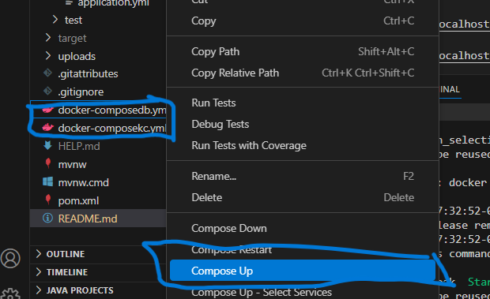 
Te debe aparecer asi y luego que se termine de ejecutar y aparezca en consola runing 2/2 puedes revisar en DockerDesktop que este corriendo 
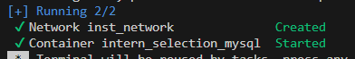 
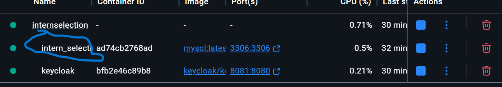 

Ahora a ingresar la base de datos ingresando en ella en docker se le da en el name intern_selection_db nos dirigimos a exec y escribimos lo siguiente 
```bash
mysql -h localhost -P 3306 -u user -p
```
nos pedira la contraseña la cual es 123. Luego ahi si integramos la base de datos entonces compiamos y pegamos esto
```bash
DROP DATABASE intern_db;
CREATE DATABASE intern_db;
USE intern_db;
CREATE TABLE intern ( 
  id INT AUTO_INCREMENT PRIMARY KEY,
  first_name VARCHAR(255) NOT NULL,
  last_name VARCHAR(255) NOT NULL,
  email VARCHAR(255) NOT NULL,
  career VARCHAR(255) NOT NULL,
  semester INT NOT NULL,
  cv_path VARCHAR(512),
  statev ENUM('PENDIENTE', 'VIABLE', 'NO_VIABLE') DEFAULT 'PENDIENTE'
) DEFAULT CHARSET = utf8mb4 COLLATE = utf8mb4_unicode_ci;
```
ya quedaria todo el contedor de la base de datos ahora continuamos con el de keycloak haciendo el mismo procedimiento que hicimos con la base de datos  en visual studio damos clic derecho al archivo docker-composekc.yml. Esto puede demorar un poco porque esta descargando la imagen e inicializando keycloaok

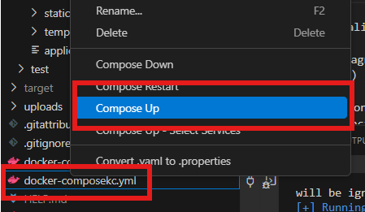 

Luego de que ya todo este corriendo debemos entrar a 
```bash
localhost:8081
```
En el navegador y nos saldra el login master de keycloak en el cual predefinimos que el user es admin y la contraseña admin 123.
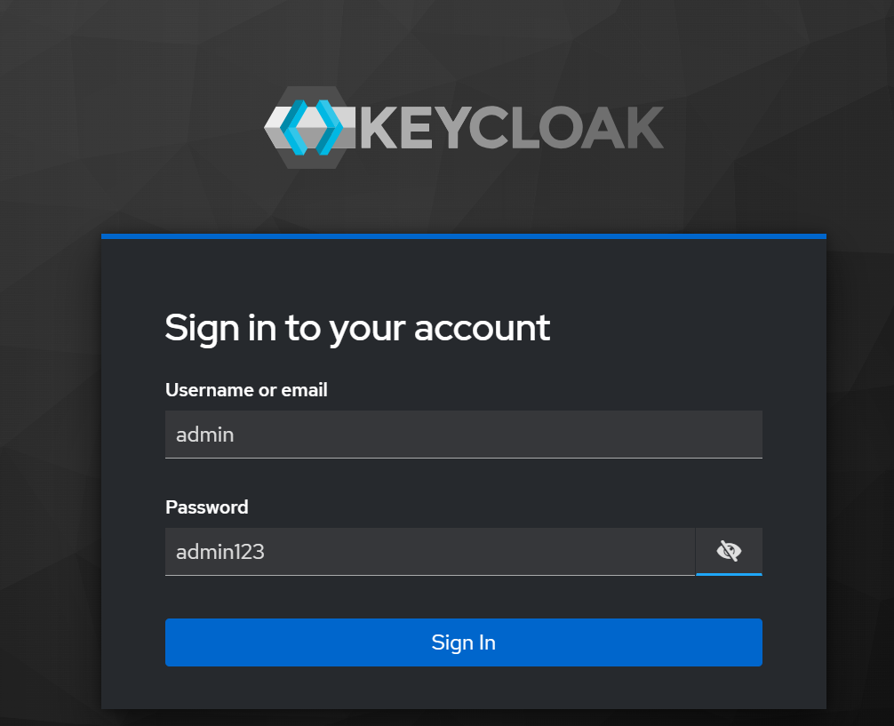

Luego de estar dentro debemos importar un realm-export.json dandole a manage-realms y luego greate 
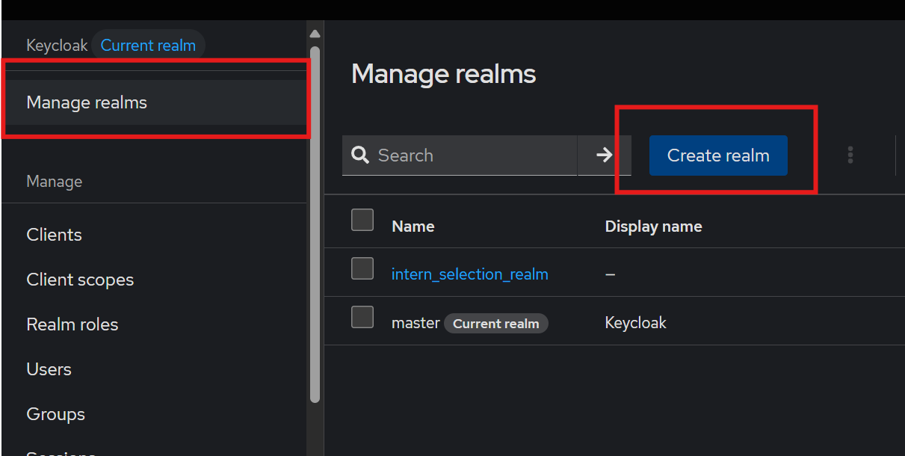
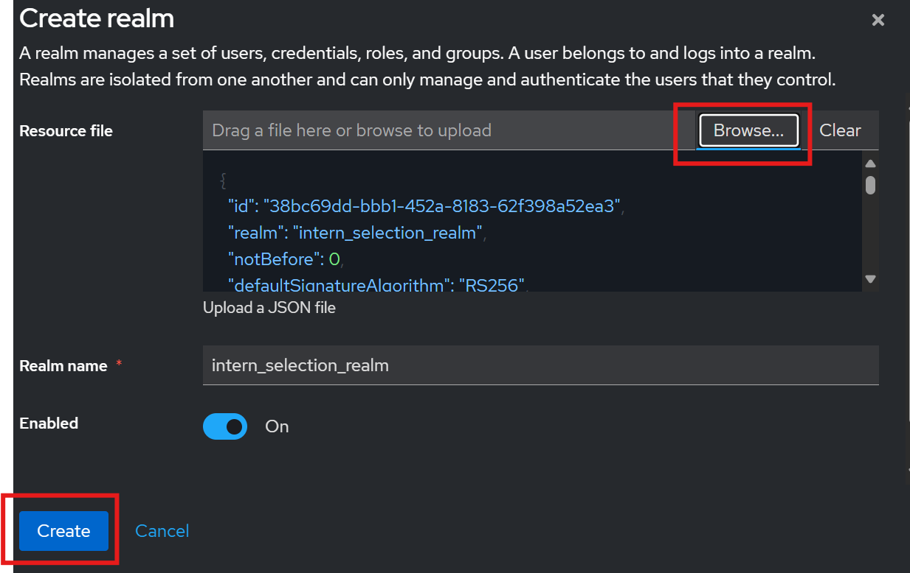
Lo podemos buscar el raiz del proyecto

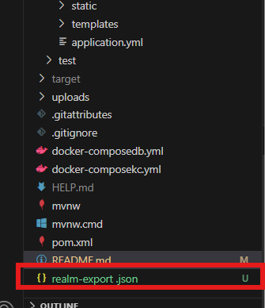

Para usar el realm debebos darle clic a manage realm y darle clic al realm que hemos creado
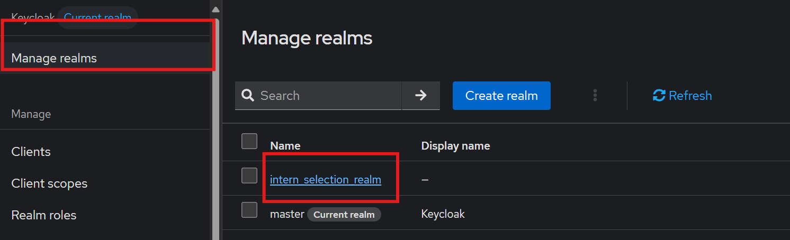

Luego de esto podemos crear el usuario y darle sus credenciales (contraseña)este es el usario que iniciara sesión como analista al querer ver la info.
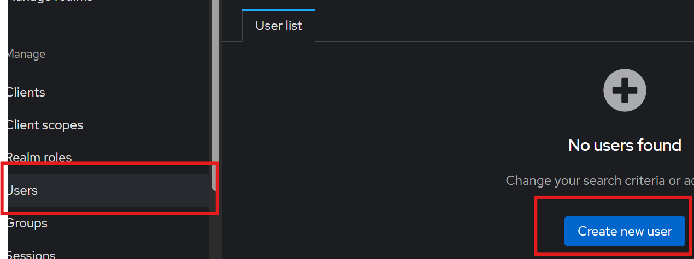

Le damos un nombre y ponemos create 
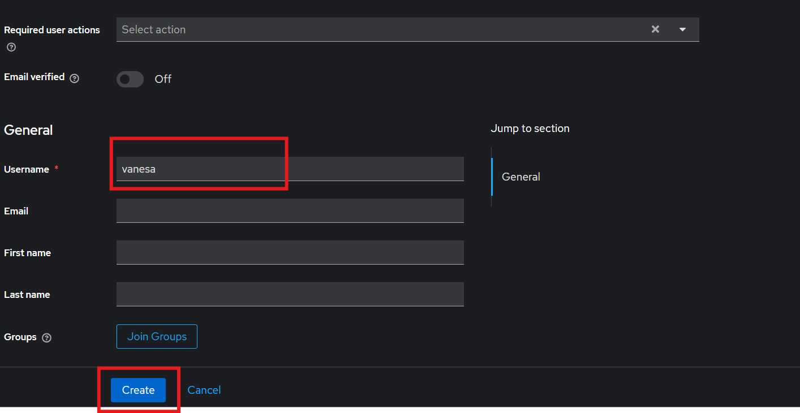

Ahora le asignamos las credenciales 
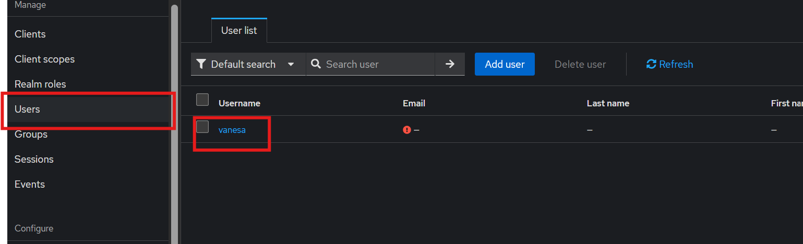

Damos clic al usario que creamos
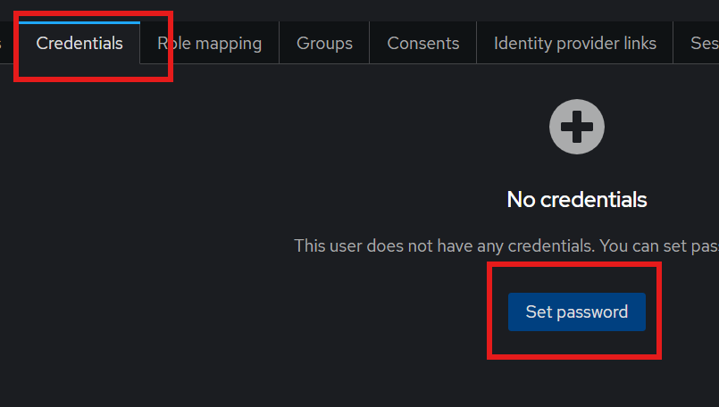

Nos asegura de que poner en off la opción de temporary y ponemos la contraseña que queramos y le damos a save
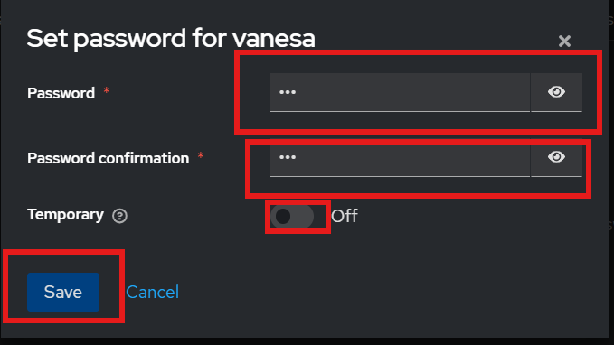

## 5. Corre el backend
Seleccionas la clase InternselectionApplication.java y le das la boton de run 
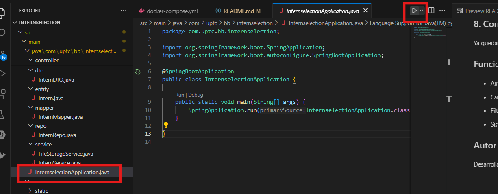

Si esta todo bien deberia salir asi 
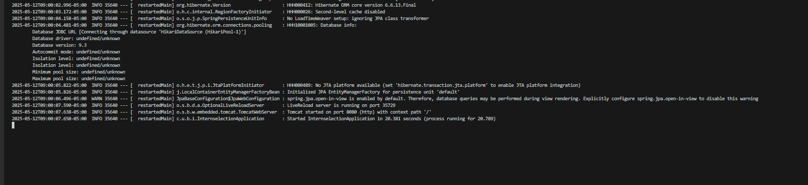


## 6. Descarga el repositorio de from en alguna carpeta que quiera

```bash
git clone https://github.com/LVanesa6/internselectionfront.git
cd internselectionfront
```
### 7. Abre el proyecto en Visual Studio Code

```bash
code .
```
## 8. Corre el frotnend react 
Le das crtl + ñ para ver la terminal 
le das al comando npm install
```bash
npm install
```
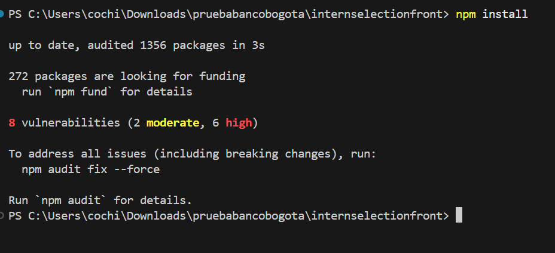

Luego de que se termine de ejecutar todo le das al comando npm start
```bash
npm start
```

Se va abrir una ventana de tu navegador en el puerto 3000 y ya quedaria funcionando la app 
```bash
localhost:3000   -- En el navegador --
```
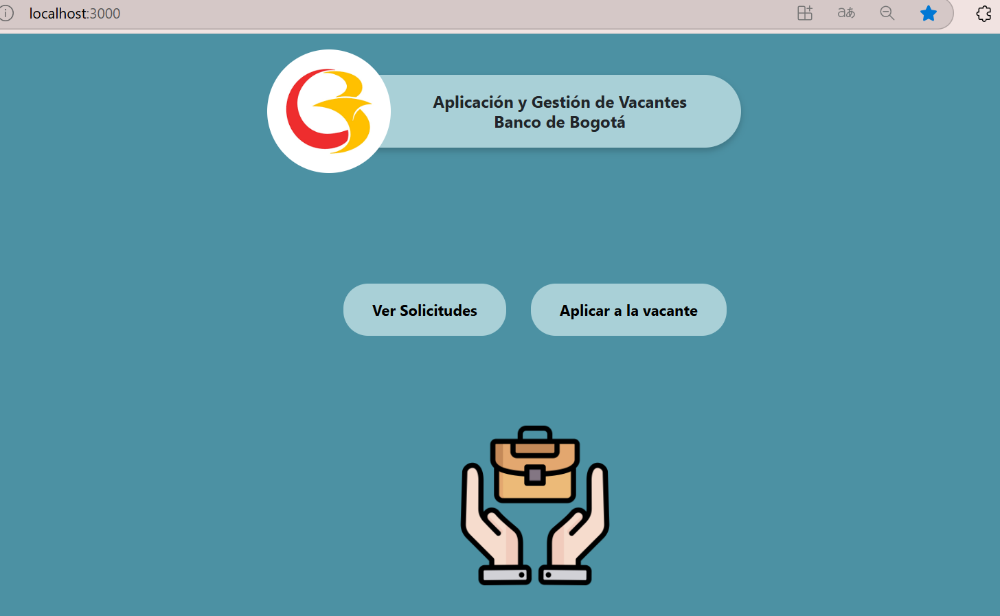
## Funcionalidades Adicionales
- Autenticación completa con Keycloak

- Carga y descarga de archivos

- Filtros de busqueda 

- Sistema modular con microservicios separados en contenedores

## Autor
Desarrollado por [Laura Vanesa Fernandez Barreto]
 Contacto: [lvfb16@gmail.com]